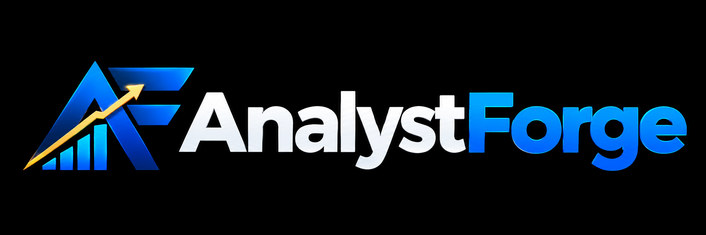
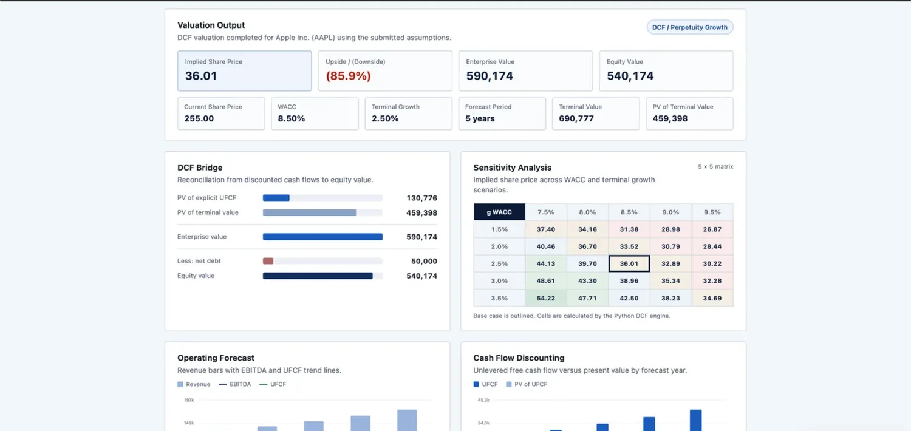
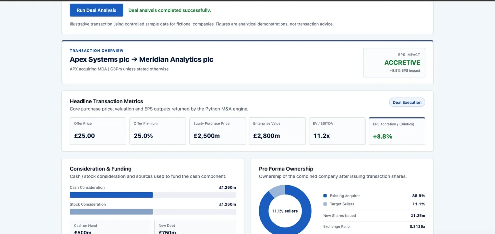
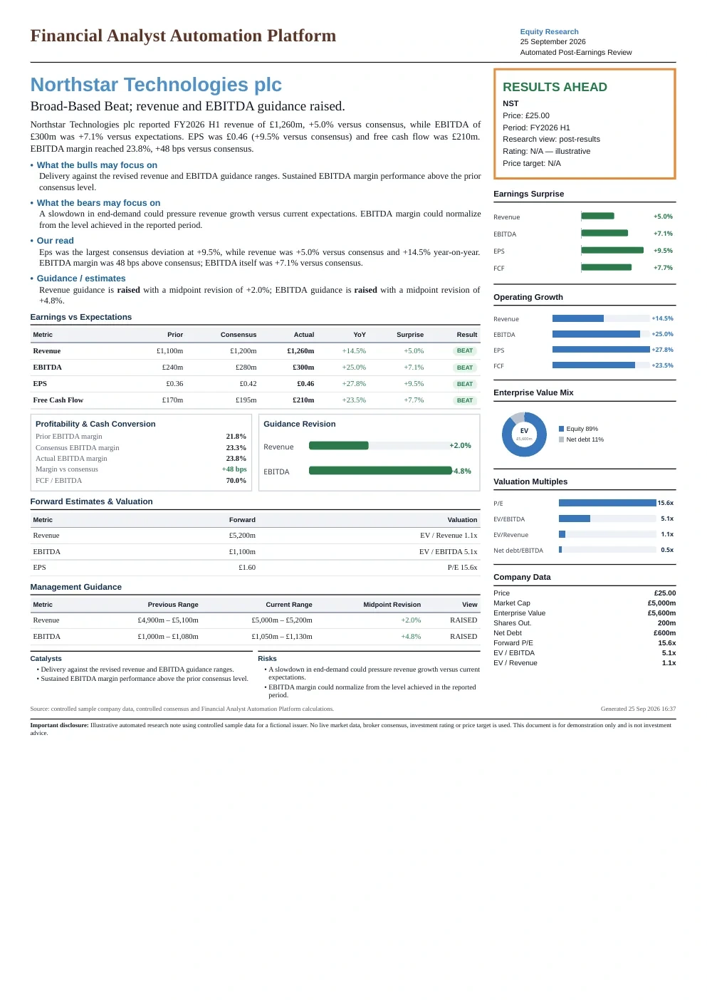
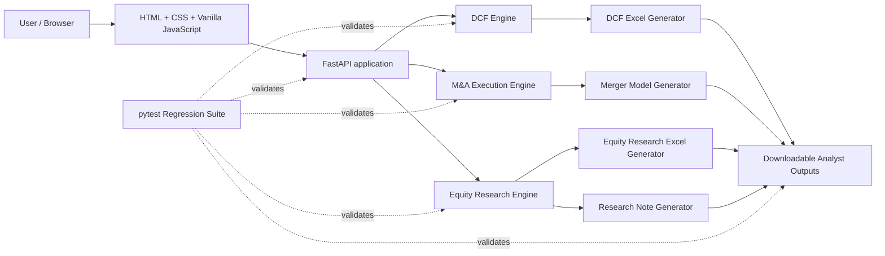

<p align="center">
  
</p>

<p align="center">
  <strong>A financial-analysis workbench for valuation, M&A execution and equity research.</strong>
</p>

<p align="center">
  <a href="#workflows">Workflows</a> ·
  <a href="#architecture">Architecture</a> ·
  <a href="#screenshots">Screenshots</a> ·
  <a href="#local-setup">Local setup</a> ·
  <a href="#testing">Testing</a> ·
  <a href="#deployment">Deployment</a>
</p>

---

## Overview

**AnalystForge** is a portfolio-grade financial-analysis platform that turns structured assumptions into transparent, analyst-ready outputs. It combines tested Python financial engines, a FastAPI application layer, interactive browser dashboards and downloadable Excel deliverables.

The project currently includes three workflows:

- **Valuation** — DCF valuation, forecast cash flows, sensitivity analysis, valuation bridge and downloadable Excel model.
- **M&A Execution** — transaction structuring, purchase price, sources & uses, purchase accounting, ownership, accretion / dilution, break-even synergies, sensitivities and a professional merger model.
- **Equity Research** — post-earnings analysis, consensus surprises, margins, guidance revisions, valuation multiples, research dashboard, Excel model and a one-page research note.

> **Model context:** AnalystForge currently uses controlled illustrative sample data. It is designed to demonstrate modelling, workflow automation and communication of financial analysis. It does not provide live market data, investment ratings or investment advice.

## Why I built it

Financial modelling is often taught as a spreadsheet exercise, while real analytical work requires a broader workflow: assumptions, model logic, quality control, interpretation and communication. AnalystForge brings those pieces together in one environment so that a user can trace an input through the Python engine, inspect the dashboard output, and download a structured Excel deliverable.

## Workflows

### 1. Valuation

The valuation workflow models a DCF from user assumptions and controlled historical data.

**Core outputs**
- Revenue, EBITDA, EBIT, NOPAT and UFCF forecasts
- Terminal value and discounted cash flows
- Enterprise value and equity value
- Implied share price and upside / downside
- WACC × terminal-growth sensitivity matrix
- Formula-driven Excel model with reconciliation checks

### 2. M&A Execution

The M&A workflow models the mechanics of a simplified acquisition.

**Core outputs**
- Offer premium, equity purchase price and enterprise value
- Cash / stock consideration and financing requirements
- New debt, new shares and pro-forma ownership
- Purchase accounting and goodwill
- Pro-forma net income and EPS
- EPS accretion / dilution and break-even synergies
- Offer-price × synergy sensitivity analysis
- Downloadable merger model with model checks

### 3. Equity Research

The equity-research workflow models a controlled post-earnings review.

**Core outputs**
- Revenue, EBITDA, EPS and free-cash-flow surprises
- Year-on-year growth and profitability analysis
- EBITDA margin and cash conversion
- Management-guidance revisions
- Forward valuation multiples
- Deterministic takeaways, catalysts and risks
- Excel research model and one-page research note

## Screenshots

### Valuation dashboard

<p align="center">
  
</p>

### M&A execution dashboard

<p align="center">
  
</p>

### Equity-research output

<p align="center">
  
</p>

## Architecture



The Python engines remain the source of truth for analytical calculations. The browser renders returned results rather than reimplementing the core finance logic in JavaScript.

For more detail, see [`docs/ARCHITECTURE.md`](docs/ARCHITECTURE.md).

## Technology stack

| Layer | Technology |
| --- | --- |
| Backend | Python, FastAPI |
| Financial engines | Python dataclasses and deterministic calculation logic |
| Excel generation | openpyxl / XlsxWriter |
| Frontend | HTML, CSS, vanilla JavaScript |
| API validation | Pydantic / FastAPI models |
| Testing | pytest, FastAPI TestClient |
| Data handling | pandas, NumPy |
| Deployment | Uvicorn, Docker / Render-ready configuration |

## Project structure

```text
analystforge/
├── backend/
│   ├── main.py
│   ├── dcf.py
│   ├── excel_generator.py
│   ├── equity_research.py
│   ├── equity_research_excel.py
│   ├── equity_research_report.py
│   ├── ma_execution.py
│   ├── ma_api.py
│   ├── ma_excel_generator.py
│   └── templates/
│       └── ma_merger_model_template.xlsx
│
├── frontend/
│   ├── index.html
│   ├── styles.css
│   ├── app.js
│   ├── brand/
│   └── showcase/
│
├── tests/
├── outputs/                 # generated locally; ignored by Git
├── docs/
├── .github/workflows/
├── .gitignore
├── Dockerfile
├── Procfile
├── render.yaml
├── pytest.ini
├── requirements.txt
└── README.md
```

## API surface

| Method | Endpoint | Purpose |
| --- | --- | --- |
| `GET` | `/` | Serve AnalystForge frontend |
| `GET` | `/api/health` | Health check |
| `POST` | `/api/dcf` | Run DCF valuation |
| `POST` | `/api/dcf/sensitivity` | Generate DCF sensitivity data |
| `POST` | `/api/dcf/excel` | Download DCF Excel model |
| `POST` | `/api/ma-execution` | Run M&A execution analysis |
| `POST` | `/api/ma-execution/excel` | Download merger model |
| `POST` | `/api/equity-research` | Run post-earnings analysis |
| `POST` | `/api/equity-research/excel` | Download equity-research workbook |
| `POST` | `/api/equity-research/report` | Generate print-ready research note |

Interactive API documentation is available locally at `/docs` while the application is running.

## Local setup

### 1. Clone the repository

```bash
git clone <YOUR-GITHUB-REPOSITORY-URL>
cd analystforge
```

### 2. Create a virtual environment

```bash
python3 -m venv .venv
source .venv/bin/activate
```

### 3. Install dependencies

```bash
python -m pip install --upgrade pip
python -m pip install -r requirements.txt
```

### 4. Run the application

```bash
python -m uvicorn backend.main:app --reload
```

Open:

```text
http://127.0.0.1:8000/
```

API documentation:

```text
http://127.0.0.1:8000/docs
```

## Testing

Run the complete regression suite with:

```bash
python -m pytest -v
```

The test suite covers, among other things:

- DCF calculation logic and validation
- API contracts and error handling
- Excel model formulas and reconciliation checks
- M&A transaction mechanics and accretion / dilution
- Equity-research calculations and report generation
- Frontend workflows and download behavior
- Website navigation, accessibility and interaction states

CI is configured through GitHub Actions in `.github/workflows/tests.yml` so the suite runs automatically on pushes and pull requests to `main`.

## Deployment

The repository includes three deployment options:

- `render.yaml` for Render
- `Procfile` for platforms using a process definition
- `Dockerfile` for container-based deployment

The production start command is:

```bash
python -m uvicorn backend.main:app --host 0.0.0.0 --port $PORT
```

The application health endpoint is:

```text
/api/health
```

See [`docs/DEPLOYMENT.md`](docs/DEPLOYMENT.md) before publishing the site.

## Model conventions and limitations

- Current datasets are controlled and illustrative rather than live feeds.
- Outputs are deterministic from the submitted assumptions.
- The platform is an analytical and educational demonstration, not an investment recommendation engine.
- Excel models expose formulas and reconciliation checks so outputs can be inspected rather than treated as black-box results.
- Live data, authentication, persistent user accounts and production observability are intentionally outside the current portfolio scope.

## Creator

**Jasjit Singh Bhatia** — Warwick Business School graduate, MSc Business & Finance.

Experience spans treasury, financial analysis, audit and investment services, with a technical toolkit covering financial modelling, valuation, Advanced Excel, Bloomberg/BQL, Python, FastAPI, pytest and frontend development.

<p>
  <a href="https://www.linkedin.com/in/jasjitsinghbhatia/">LinkedIn</a> ·
  <a href="https://www.instagram.com/jasjitsingh_17/">Instagram</a> ·
  <a href="mailto:jasjitsingh170@gmail.com">Email</a>
</p>

---

<p align="center">
  <strong>AnalystForge</strong><br>
  Financial analysis, forged into workflows.
</p>
