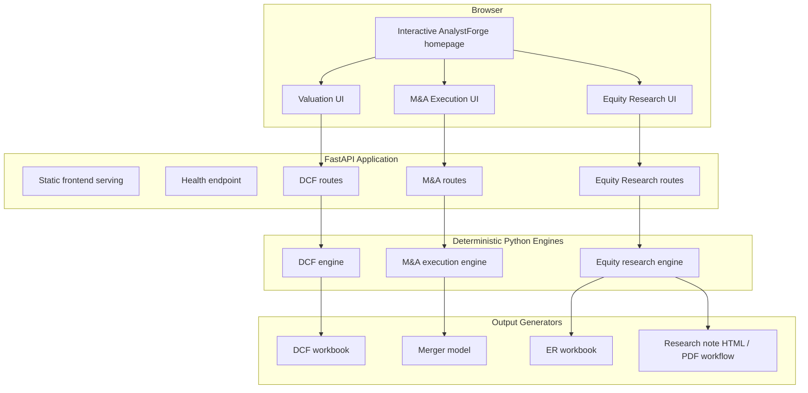

# AnalystForge Architecture

## Design principle

AnalystForge is deliberately structured so that analytical logic lives in tested Python engines rather than in the browser. The frontend collects assumptions, submits them to FastAPI and renders the returned results. Excel and research-note outputs are generated from the same engine results, reducing the risk that the website and downloadable deliverables use different calculations.

## System diagram

## Request flow

1. A user enters assumptions in one of the three browser workflows.
2. Vanilla JavaScript normalizes form inputs and sends a request to FastAPI.
3. Pydantic/FastAPI validates the request contract.
4. The relevant Python engine performs the financial calculations.
5. The API serializes the engine result and returns it to the browser.
6. The frontend renders the dashboard from API-returned fields.
7. For downloads, the server reruns the same engine and passes its result to the corresponding workbook/report generator.
8. Model-check sheets reconcile key Excel outputs back to Python-engine reference values.

## Core modules

### `backend/dcf.py`

Source of truth for DCF forecast and valuation calculations.

### `backend/excel_generator.py`

Generates the professional DCF workbook, including assumptions, historicals, forecast, DCF bridge, sensitivity and model checks.

### `backend/ma_execution.py`

Source of truth for transaction mechanics, financing, purchase accounting, pro-forma EPS, accretion/dilution and break-even synergies.

### `backend/ma_api.py`

Exposes M&A API contracts and workbook-download routing.

### `backend/ma_excel_generator.py`

Builds the professional merger model and sensitivity analysis.

### `backend/equity_research.py`

Calculates earnings surprises, growth, margins, guidance revisions, valuation multiples and deterministic research takeaways.

### `backend/equity_research_excel.py`

Generates the equity-research Excel model.

### `backend/equity_research_report.py`

Produces the print-ready one-page research-note workflow.

### `backend/main.py`

Creates the FastAPI application, serves the frontend and registers the analytical endpoints.

## Frontend architecture

The frontend intentionally uses HTML, CSS and vanilla JavaScript rather than a framework. This keeps the portfolio project transparent and makes it straightforward to trace UI behavior to API requests.

Important frontend responsibilities include:

- interactive home experience and sidebar navigation;
- workflow forms and client-side input normalization;
- rendering returned analytical outputs;
- screenshot guidance and output gallery;
- downloadable-model triggers;
- accessibility states, reduced-motion handling and responsive layout.

The frontend does **not** duplicate core DCF, M&A or equity-research formulas.

## Testing strategy

The test suite covers three levels:

1. **Engine tests** — finance formulas, edge cases and validation.
2. **API tests** — request/response contracts, serialization and errors.
3. **Presentation/output tests** — frontend wiring, workbook formulas, downloads, reports and regression checks.

The repository also contains a GitHub Actions workflow so these tests run automatically on pushes and pull requests.
